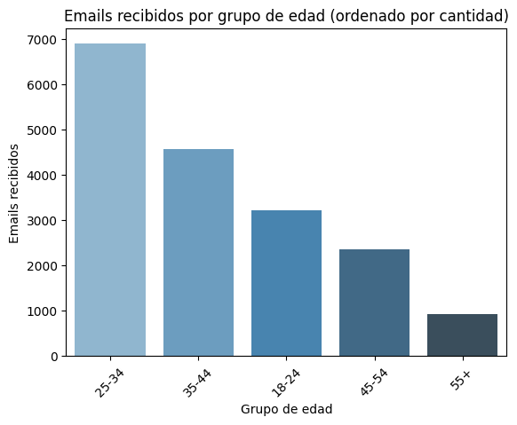
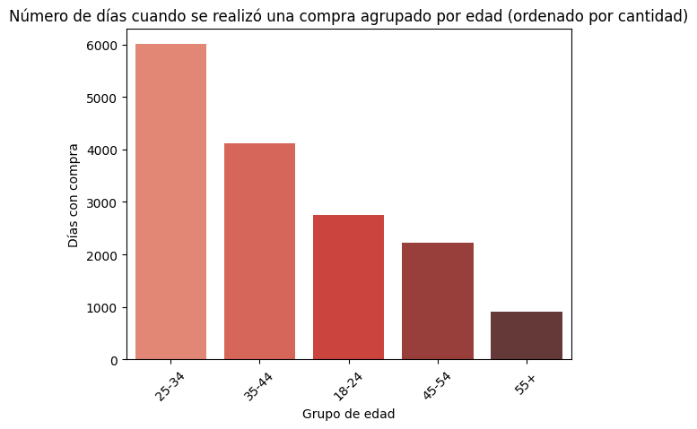
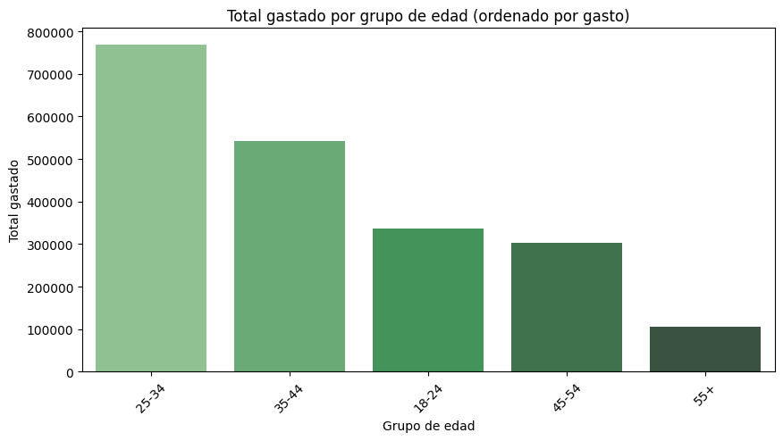
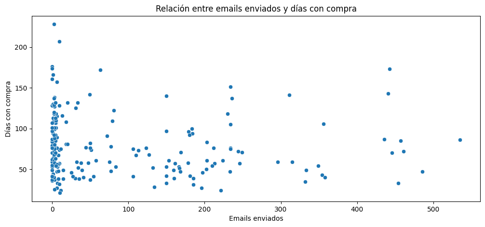
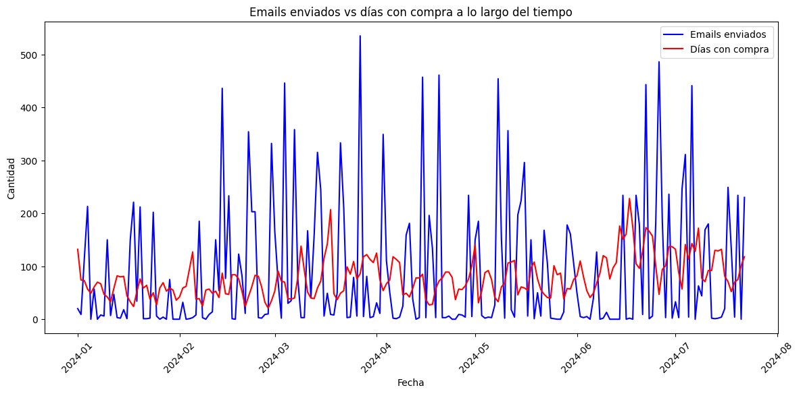
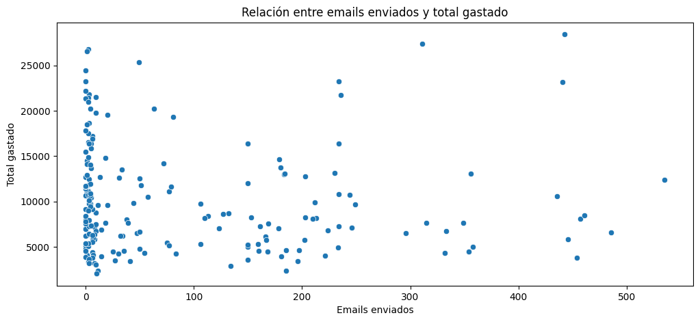
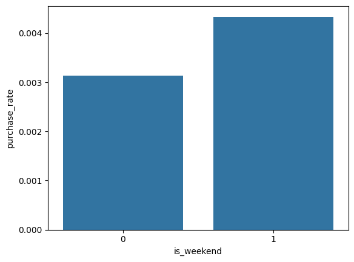
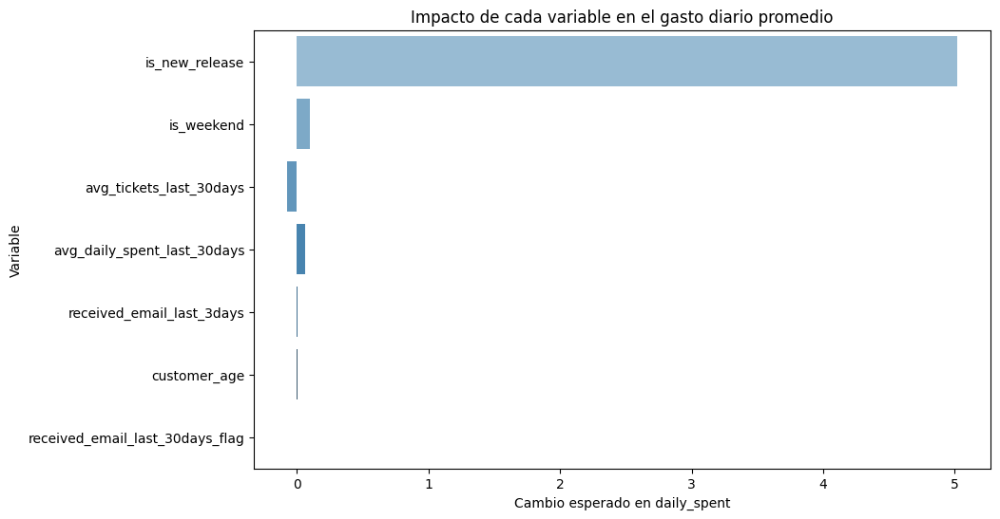

# Marketing ROI Analytics Pipeline with PySpark

> **To what extent do email communications influence cinema visits or customer spending?**

This project builds an end-to-end analytics pipeline to measure the causal impact of email marketing campaigns on customer purchase behavior for a cinema chain. The analysis spans January-July 2024 and combines transactional data, customer demographics, email exposure records, and movie release metadata to answer three core business questions:

- Do customers who receive more emails go to the cinema more often?
- Do emails increase the number of tickets sold or the average spend?
- Does the effect depend on the type of movie, theater, or season?

---

## Table of Contents

1. [Tech Stack](#tech-stack)
2. [Datasets](#datasets)
3. [Pipeline Architecture](#pipeline-architecture)
4. [Feature Engineering](#feature-engineering)
5. [Exploratory Data Analysis](#exploratory-data-analysis)
6. [Regression Models](#regression-models)
7. [Results](#results)
8. [Key Findings & Recommendations](#key-findings--recommendations)
9. [Data Leakage Handling](#data-leakage-handling)

---

## Tech Stack

| Layer | Tools |
|---|---|
| Distributed computing | PySpark 3.x with Adaptive Query Execution |
| Data wrangling | Pandas, PySpark SQL |
| Machine learning | PySpark MLlib - Logistic Regression, Linear Regression, StandardScaler, VectorAssembler |
| Visualization | Matplotlib, Seaborn |
| Environment | Python 3.12, Jupyter Notebook |

The pipeline is built on **PySpark** throughout - not as a wrapper around Pandas, but using its native distributed primitives: window functions over partitioned DataFrames, broadcast joins for dimension tables, crossJoin for the customer-day grid, and the MLlib pipeline for model training and evaluation. Adaptive Query Execution (`spark.sql.adaptive.enabled`) is enabled to allow runtime reoptimization of join strategies and shuffle partitions.

---

## Datasets

| Dataset | Key Columns | Role |
|---|---|---|
| `Transactions.csv` | `CARD_MEMBERSHIPID`, `FECHA_TRANSACCION`, `BOLETOS`, `IMPORTE_TAQUILLA` | Source for visits and spending |
| `Emails.csv` | `SubscriberKeyH`, `EventDate`, `SendId` | Source of email exposure |
| `Customers.csv` | `CARD_MEMBERSHIPID`, `SubscriberKeyH`, `DATE_OF_BIRTH` | Links customers to emails; enables age segmentation |
| `Releases.csv` | `TX_PELICULA_UNICA`, `ESTRENO`, `VENTAS` | Controls for content and seasonality effects |
| `Pricebook.csv` | `ID_CINE`, `ANIO`, `PRECIO_POL_R` | Controls for price variation across cinemas and years |

### Email Coverage

A critical limitation of this dataset is the low email linkage rate - only ~23,800 emails (~1.3% of total) could be matched to a customer record. This constrains the analysis to a subset of customers and limits the detection of cumulative email effects.

| Metric | Value |
|---|---|
| Total linked emails | 23,789 |
| Unique customers with >=1 email | ~23,800 |
| Average emails per linked customer | 1.06 |

---

## Pipeline Architecture

The pipeline follows a strict sequential structure designed to avoid data leakage at every step.

```
Raw CSVs (Pandas)
      │
      ▼
Data Wrangling & Cleaning
  - Parse dates
  - Drop duplicates
  - Filter invalid birth years (< 1939 or > 2009)
  - Parse pipe-delimited releases file
      │
      ▼
Spark Session + DataFrame Creation
  - Cast types, rename columns
  - Link emails -> customers via SubscriberKeyH
      │
      ▼
Customer-Day Grid (crossJoin)
  - One row per (customer_id, date) for every day in range
  - ~23,800 customers x 204 days
      │
      ▼
Feature Engineering (Window Functions)
  - Email exposure flags (last 3 and 30 days)
  - Rolling averages of spend and tickets (lag-corrected)
  - is_new_release, is_weekend, customer_age
      │
      ▼
persist() -- grid reused by EDA + ML
      │
      ├──▶ EDA (aggregations, correlations, plots)
      │
      └──▶ ML Pipeline
             - VectorAssembler + StandardScaler
             - Temporal train/test split (cutoff: 2024-06-15)
             - Logistic Regression (target: purchased_on_day)
             - Linear Regression (target: daily_spent)
```

---

## Feature Engineering

All features are computed using **PySpark window functions** partitioned by `customer_id` and ordered by `date`. The key design decision is that every rolling feature uses `rowsBetween(-N, -1)` - excluding the current day - to prevent target leakage into the predictors.

| Feature | Logic | Type |
|---|---|---|
| `received_email` | 1 if customer received an email on that date | integer |
| `received_email_last_3days` | Sum of emails received in the 3 prior days | long |
| `received_email_last_30days` | Sum of emails received in the 30 prior days | long |
| `received_email_last_30days_flag` | Binary flag from the above | integer |
| `purchased_on_day` | 1 if customer made any purchase that day | integer |
| `daily_spent` | Total amount spent by customer that day | double |
| `daily_tickets` | Total tickets purchased that day | long |
| `avg_daily_spent_last_30days` | Rolling average of daily spend, days [-30, -1] | double |
| `avg_tickets_last_30days` | Rolling average of tickets, days [-30, -1] | double |
| `days_since_last_email` | Days between last received email and current date | integer |
| `is_new_release` | 1 if movie released within the last 7 days | integer |
| `is_weekend` | 1 if Saturday or Sunday | integer |
| `customer_age` | 2024 minus birth year | integer |

```python
# Example: lag-corrected rolling average - excludes today to prevent leakage
window_30d_lag = Window.partitionBy("customer_id").orderBy("date").rowsBetween(-30, -1)

customer_day_grid = (
    customer_day_grid
    .withColumn("avg_daily_spent_last_30days", Favg("daily_spent").over(window_30d_lag))
    .withColumn("avg_tickets_last_30days",     Favg("daily_tickets").over(window_30d_lag))
)
```

---

## Exploratory Data Analysis

### Emails received by age group



### Purchase days by age group



### Total spend by age group



### Emails sent vs. purchase days over time



### Emails sent vs. purchase days over time (time series)



### Emails sent vs. total spend (scatter)



### Weekend vs. weekday purchase rate



### Key EDA findings

- The correlation between total emails received and total spending per customer is nearly zero (r ~ 0.002), indicating no strong linear relationship between email volume and spending.
- The correlation between days since the last email and purchase likelihood is slightly negative (-0.025), suggesting that recency of email contact has a marginal positive association with purchasing.
- Weekend purchase rates are marginally higher, and customers tend to receive slightly more emails in the three days prior to a weekend transaction.

---

## Regression Models

### Train / Test Split

A **temporal split** is used instead of random shuffling. All rows before `2024-06-15` form the training set; rows on or after form the test set. This mirrors real deployment conditions where the model always predicts future behavior from past data, and prevents rolling window features from leaking future information into training.

```python
TEMPORAL_CUTOFF = "2024-06-15"

train_data_raw = data_sample.filter(col("date") <  F.lit(TEMPORAL_CUTOFF).cast("date"))
test_data_raw  = data_sample.filter(col("date") >= F.lit(TEMPORAL_CUTOFF).cast("date"))

# Scaler fitted on train only - frozen before applying to test
scaler_model = scaler.fit(train_data_raw)
train_data   = scaler_model.transform(train_data_raw)
test_data    = scaler_model.transform(test_data_raw)
```

### H1 - Logistic Regression: Does email exposure increase purchase probability?

- **Target:** `purchased_on_day`
- **AUC: 0.774**

### H2 - Linear Regression: Does email exposure increase daily spend?

- **Target:** `daily_spent`
- **R2: 0.294 | RMSE: 10.30**

### Coefficient plot - Linear Regression



---

## Results

**Logistic Regression** - AUC: 0.774

**Linear Regression** - R2: 0.294 | RMSE: 10.30

An AUC of 0.774 indicates reasonable discriminative power for predicting whether a customer will make a purchase on a given day. The linear model explains ~29% of the variance in daily spend, with an RMSE of 10.30 - moderate performance expected given the inherent noise in individual daily spending behavior.

| Feature | Logistic coef. | Linear coef. |
|---|---|---|
| `is_new_release` | 1.112 | 5.018 |
| `avg_tickets_last_30days` | -0.519 | -0.071 |
| `is_weekend` | 0.284 | 0.100 |
| `avg_daily_spent_last_30days` | 0.103 | 0.061 |
| `received_email_last_30days_flag` | 0.074 | -0.003 |
| `customer_age` | 0.024 | 0.004 |
| `received_email_last_3days` | 0.018 | 0.008 |

`is_new_release` is the dominant predictor in both models by a wide margin, confirming that content drives attendance far more than email exposure. Email features (`received_email_last_3days`, `received_email_last_30days_flag`) rank last in both models with near-zero coefficients, while `is_weekend` and historical spending behavior show moderate but consistent effects.

---

## Key Findings & Recommendations

### Findings

1. **Emails have minimal direct effect.** Both models confirm that email exposure in the last 3 or 30 days has near-zero impact on purchase probability and daily spend. The effect is real but small.
2. **New releases are the primary driver.** `is_new_release` is the dominant predictor in both models, far outweighing any email effect.
3. **Weekends matter.** Weekend attendance increases both purchase likelihood and spending - timing is a meaningful variable.
4. **Historical behavior predicts future behavior.** `avg_daily_spent_last_30days` is a meaningful predictor, reflecting that high-value customers tend to remain high-value.
5. **Age segmentation shows variation** in email receipt and total spend, warranting further investigation.

### Recommendations

1. **Align email sends with weekends and new releases** to leverage the strongest natural demand signals rather than sending on arbitrary schedules.
2. **Prioritize high-value customers** - historical spend is the strongest behavioral predictor. Segmenting campaigns by recency and value will likely outperform volume-based sending.
3. **Reframe emails as retention tools**, not immediate purchase drivers. Pair them with promotions, loyalty incentives, or exclusive previews to amplify the weak direct effect.
4. **Run a controlled A/B test** to establish causality. The observational analysis can only show correlation; randomized assignment of email sends is required to measure true lift.
5. **Invest in improving email-customer linkage.** With only ~1.3% of emails matched to customers, the analytical base is narrow. Improving the match rate would substantially increase the power of any future analysis.

---

## Data Leakage Handling

Three forms of data leakage were identified and corrected during development:

**1. Target contamination via rolling windows**
`avg_daily_spent_last_30days` was originally computed with `rowsBetween(-30, 0)`, including the current day's spend in the feature used to predict that same day's spend. Corrected to `rowsBetween(-30, -1)`.

**2. Preprocessing leakage**
`StandardScaler` was originally fitted on the full dataset before the train/test split, allowing test-set statistics to influence training normalization. Corrected by splitting first, then fitting the scaler exclusively on training data.

**3. Temporal leakage via random split**
`randomSplit()` was originally used without regard for time ordering. On a customer-day grid with rolling features, this allows a row from April to appear in the test set while the same customer's March row - used to compute that April row's features - appears in training. Corrected by replacing `randomSplit` with a hard date cutoff.

The combined effect of these corrections reduced AUC from 0.933 -> 0.774 and R2 from 0.396 -> 0.294, producing metrics that are lower but substantially more credible and representative of real-world model performance.
